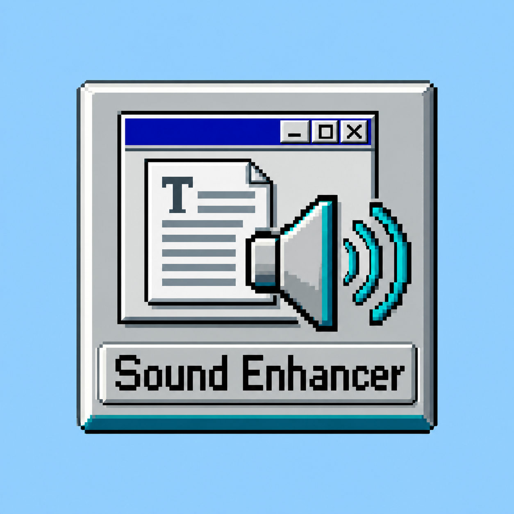
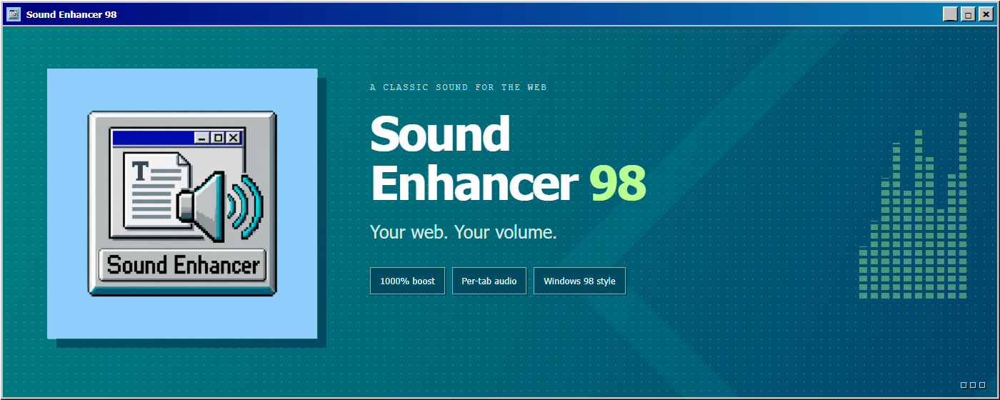
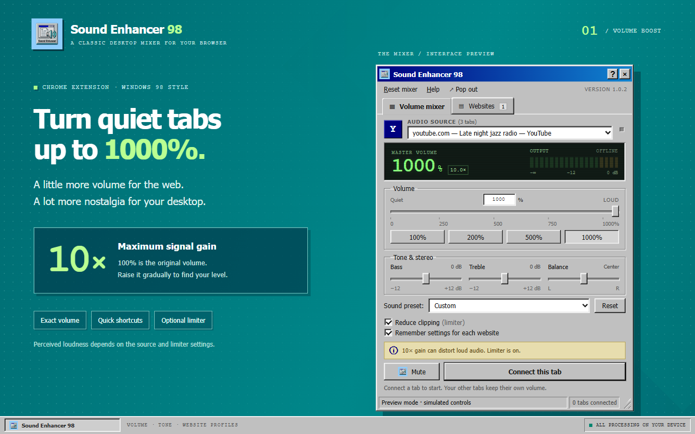
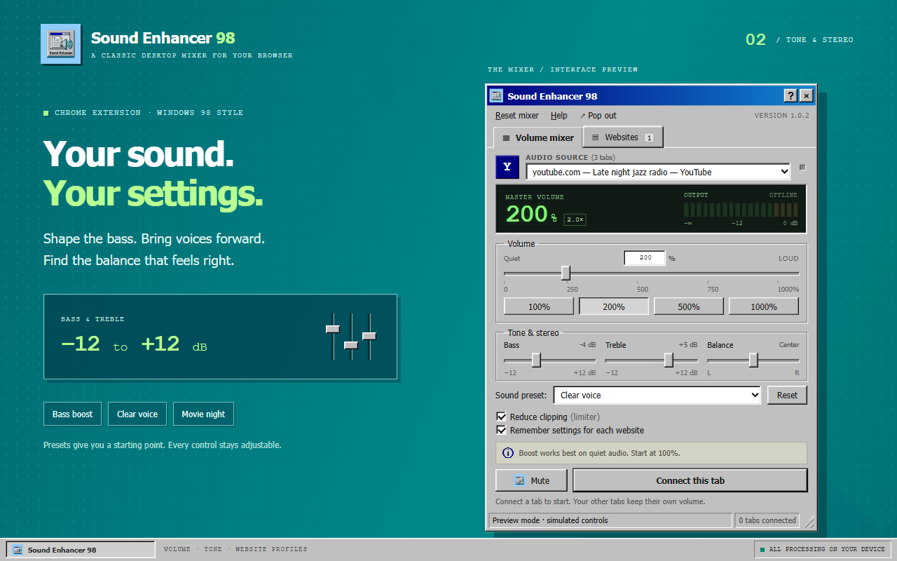
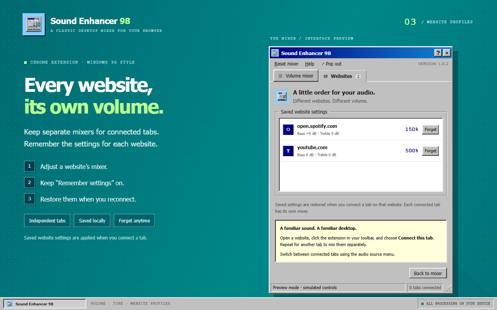
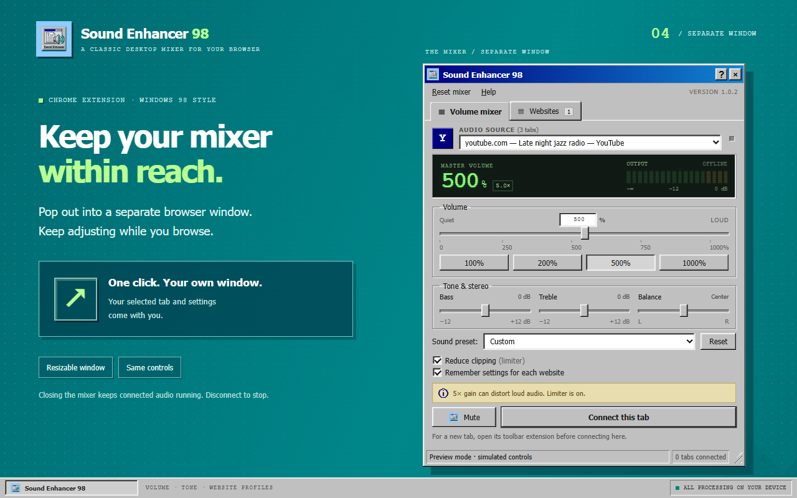
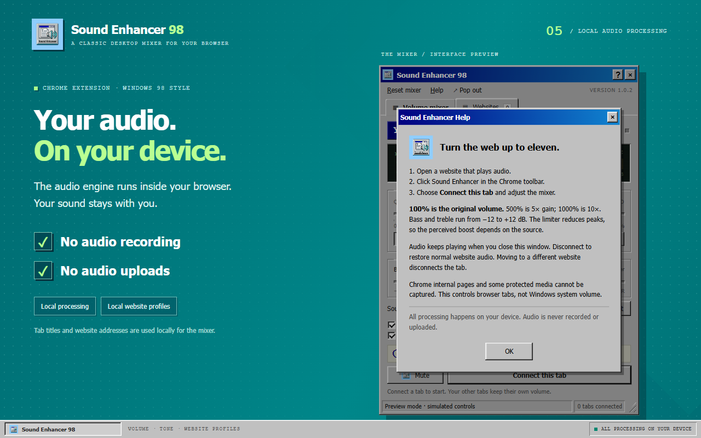
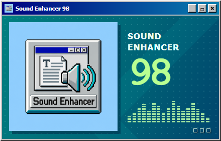

  

<h1 align="center">🔊 Sound Enhancer 98</h1>

  <strong>A classic desktop mixer for your browser.</strong> 
  Turn up quiet audio, shape your sound, and give every website its own settings. 
  All wrapped in a little Windows 98 nostalgia. 💾

  <kbd>🪟 Windows 98 style</kbd>&nbsp;
  <kbd>🔊 Up to 1000%</kbd>&nbsp;
  <kbd>🎚️ Per-tab control</kbd>&nbsp;
  <kbd>🌐 Chrome 116+</kbd>

---

## 🎯 Purpose

Some videos are too quiet. Some websites are too loud. Sound Enhancer 98 gives you a dedicated mixer for each connected Chrome tab, so you can adjust one source without changing the others.

Use it to boost a quiet lecture, add bass to your music, adjust a movie's tone, or mute one tab while another keeps playing.

## 👋 Introduction

Sound Enhancer 98 is a Chrome extension inspired by the familiar blue title bars, beveled buttons, and gray panels of Windows 98. Behind the retro interface is a browser audio mixer with volume boosting, tone controls, stereo balance, and website profiles.

Open it from the Chrome toolbar for a quick adjustment, or choose **↗ Pop out** to keep the mixer in a separate browser window while you browse. Connected audio keeps playing when you close either view.

## ✨ Features

| Feature | What you can do |
| :--- | :--- |
| 🔊 **Volume from 0–1000%** | Lower or boost a tab's audio with a slider, an exact numeric value, or 100%, 200%, 500%, and 1000% shortcuts. |
| 🎚️ **Independent tab mixers** | Adjust each connected tab separately, even when several websites are playing audio. |
| 🌐 **Saved website settings** | Remember a website's mixer settings and restore them when you connect a tab on that website. |
| 🎵 **Bass and treble** | Shape low and high frequencies with controls from −12 to +12 dB. |
| 🎧 **Stereo balance** | Move the sound toward the left or right channel. |
| 🔇 **Mute and reset** | Mute a tab without losing its volume setting, or reset the mixer to its defaults. |
| 🛡️ **Optional limiter** | Reduce audio peaks to help limit clipping when boosting the volume. |
| 🎬 **Sound presets** | Start with Default, Bass boost, Clear voice, or Movie night. |
| 📊 **Live output meter** | See the connected tab's actual output activity and when the limiter is working. |
| ↗ **Separate mixer window** | Pop out the mixer with your selected tab, settings, and current view. Open it again to bring the existing window forward. |
| 💾 **Retro interface** | Enjoy classic window controls, beveled sliders, and a green audio display. |

> [!NOTE]
> **100% is the original volume.** 500% applies 5× signal gain, and 1000% applies 10×. Perceived loudness depends on the source audio and limiter settings; high gain can still cause distortion.

## 🖼️ Preview Gallery

Explore the Windows 98 interface below. These screenshots use the extension's included preview with sample tabs. Click any screenshot to view it at full size.

### 🔊 Volume up to 1000%

| 🎚️ Tone & Stereo | 🌐 Website Profiles |
| :---: | :---: |
|  |  |
| **🪟 Separate Mixer Window** | **🔒 Local Audio Processing** |
|  |  |

### 💾 Small Promotional Tile

  

See the [complete image overview](store-assets/asset-overview.png) for all screenshots and promotional artwork together.

## 📦 Installation

**Requirements:** Chrome 116 or newer. Install the extension directly from its source folder; no build step is required.

1. **Download or clone this project.** If you downloaded a ZIP, extract it first.
2. Open **`chrome://extensions`** in Chrome.
3. Turn on **Developer mode** in the top-right corner.
4. Click **Load unpacked** and select the project folder containing [`manifest.json`](manifest.json).
5. Open Chrome's **Extensions** menu and pin **Sound Enhancer 98** to your toolbar.

### ▶️ Connect your first tab

1. Open a website and start playing audio.
2. Click **Sound Enhancer 98** in the Chrome toolbar.
3. Choose **Connect this tab**.
4. Adjust the volume, bass, treble, and balance to your liking.

> [!TIP]
> Start at **100%**, then raise the volume gradually. Try **Clear voice** for speech or **Bass boost** for music.

### 🌐 Mix multiple websites

Open another website, click the extension from that tab's toolbar, and choose **Connect this tab** again. Use the **Audio source** menu to switch between tabs and adjust their mixers.

Keep **Remember settings for each website** enabled to save your adjustments. Turn it off for temporary changes, or use **Forget** in the **Websites** view to remove a saved profile.

### 🪟 Use a separate window

Click **↗ Pop out** beside **Help** in the top menu. The mixer opens in its own browser window and stays open while you browse. Your selected tab, settings, and current view carry over, and the window can be resized.

Closing the mixer leaves connected audio running. Choose **Disconnect this tab** when you want to restore the website's original audio.

### ℹ️ Connection notes

- Connect each new tab by opening the extension from that tab's toolbar first.
- Moving a connected tab to a different website disconnects its mixer. Navigation within the same website keeps it connected.
- After restarting Chrome or reloading the extension, reconnect your tabs. Saved website settings remain available.
- Controls apply to captured Chrome tab audio. Chrome internal pages and some protected media cannot be captured.
- If a tab is muted in Chrome itself, unmute it in Chrome to hear its audio.
- After updating the extension files, click **Reload** on its card at `chrome://extensions`.

## 🔒 Privacy

Audio processing happens locally on your device. The extension does not record or upload your audio, and website mixer profiles are stored locally in Chrome.

Read the **[Privacy Policy](PRIVACY.md)** for details about tab information, local storage, permissions, and deleting saved profiles.

## 📜 Terms of Use

For the project's existing licensing terms, read the **[Terms of Use & License — GNU GPL v3](LICENSE)**.

---

